Demographic Trait Overview
================
Matt Robertson
07/05/2021

We are currently collecting data on abundance, biomass, and length at
maturity for fish stocks around Newfoundland and Labrador. Based on our
data inputs it should be possible to separate each time-series into
stocks, species, divisions, and functional groups. The end goal will be
to assess these time-series using dynamic factor analysis (DFA) and
compare the trends to environmental trends to identify if there are
similarities in how these stocks demographies have shifted over time and
whether shared changes can be related to environmental variables.

# Length at maturity Data

## NAFO Division

### All

<!-- -->

### 2J3K

<!-- -->

### 3LNO

<!-- -->

### 3Ps

<!-- -->

### 4RST

<!-- -->

## Functional Group

### Benthivore

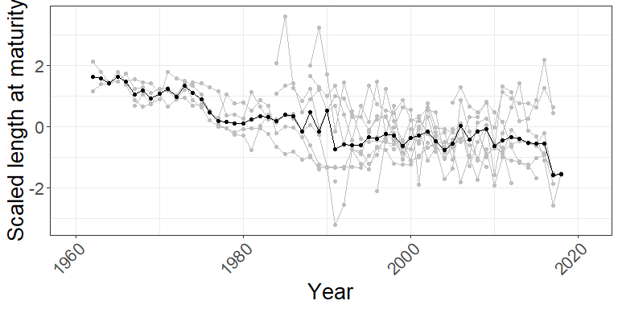<!-- -->

### Planktivore

<!-- -->

## Species Overview

### American plaice

<!-- --> \#\#\#\#
Aggregated Median

<!-- -->

### Atlantic Mackerel

<!-- -->

#### Aggregated Median

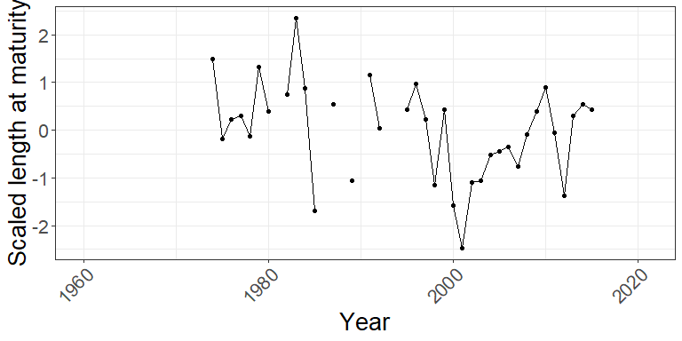<!-- -->

### Herring

<!-- -->

#### Aggregated Median

<!-- -->

### Roughhead Grenadier

<!-- -->

#### Aggregated Median

<!-- -->

### Witch flounder

<!-- -->

#### Aggregated Median

<!-- -->

### Yellowtail flounder

<!-- -->

#### Aggregated Median

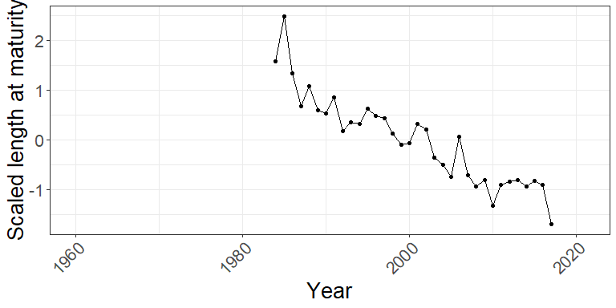<!-- -->

# Abundance Data

## Species Overview

### Thorny skate

<!-- -->

#### Aggregated Mean

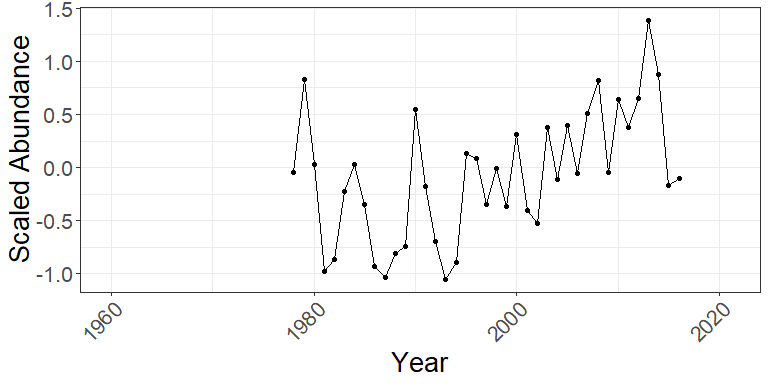<!-- -->

#### Aggregated Median

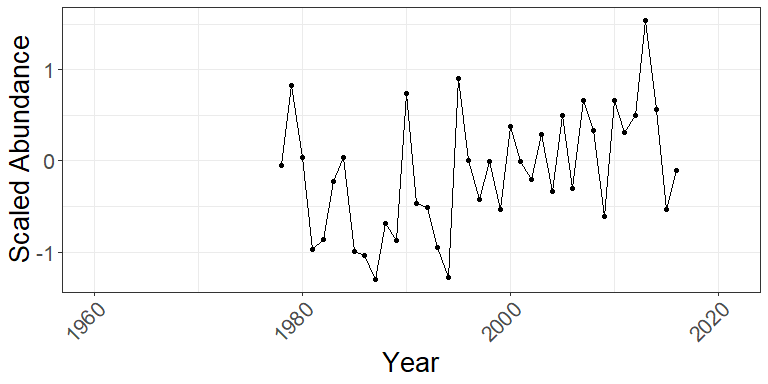<!-- -->

### Yellowtail flounder

<!-- -->

#### Aggregated Mean

<!-- -->

#### Aggregated Median

<!-- -->

## NAFO Division

### 2J3K

<!-- -->

#### Aggregated Mean

<!-- -->

#### Aggregated Median

<!-- -->

### 3LNO

<!-- -->

#### Aggregated Mean

<!-- -->

#### Aggregated Median

<!-- -->

### 3Ps

<!-- -->

#### Aggregated Mean

<!-- -->

#### Aggregated Median

<!-- -->

### 4RST

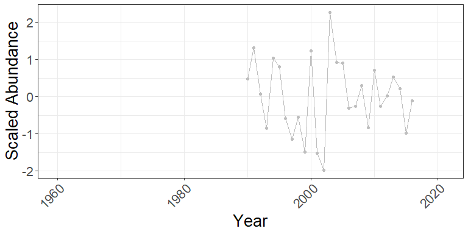<!-- -->

#### Aggregated Mean

<!-- -->

#### Aggregated Median

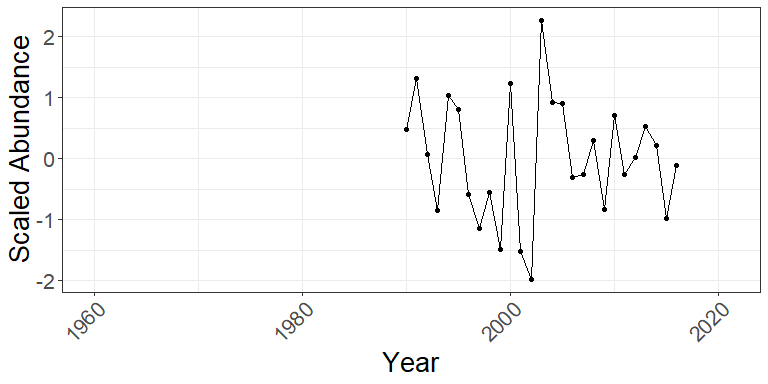<!-- -->

# Biomass Data

## Species Overview

### Thorny skate

<!-- -->

#### Aggregated Mean

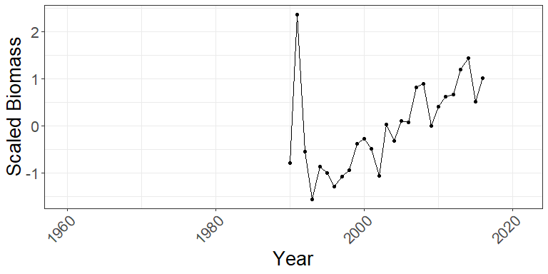<!-- -->

#### Aggregated Median

<!-- -->

### Yellowtail flounder

<!-- -->

#### Aggregated Mean

<!-- -->

#### Aggregated Median

<!-- -->

## NAFO Division

### 2J3K

<!-- -->

#### Aggregated Mean

<!-- -->

#### Aggregated Median

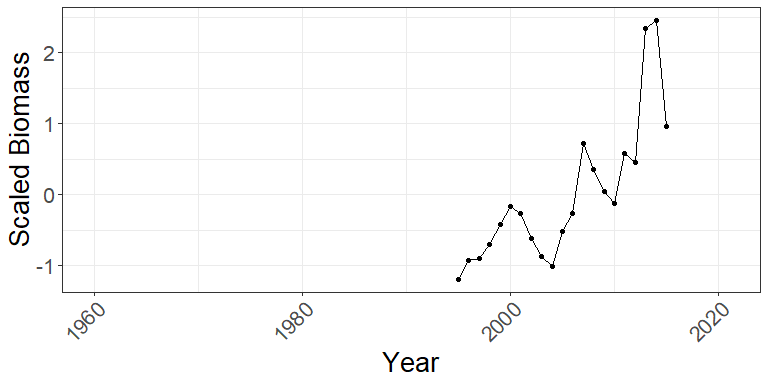<!-- -->

### 3LNO

<!-- -->

#### Aggregated Mean

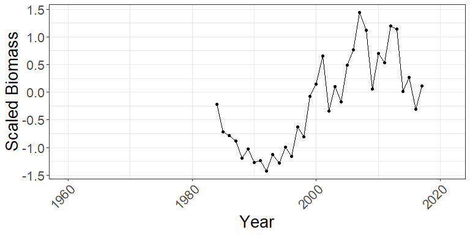<!-- -->

#### Aggregated Median

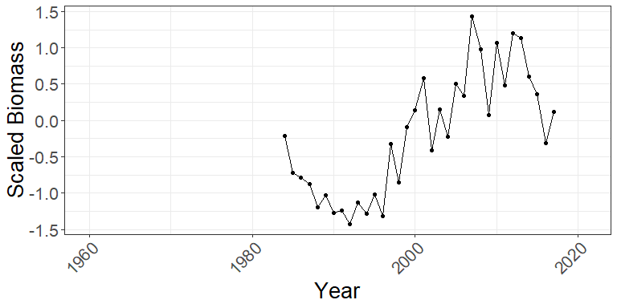<!-- -->

### 3Ps

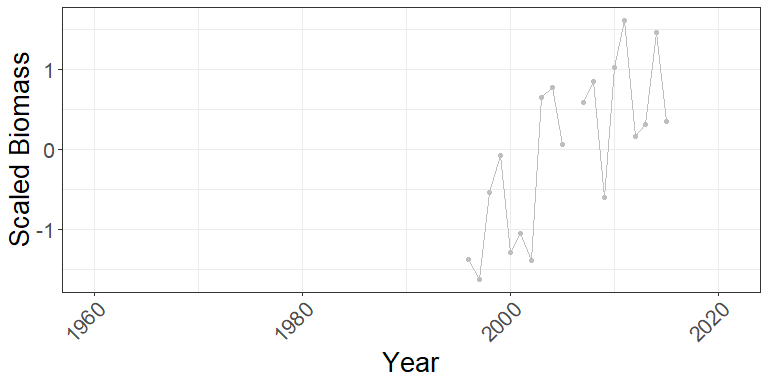<!-- -->

#### Aggregated Mean

<!-- -->

#### Aggregated Median

<!-- -->

### 4RST

<!-- -->

#### Aggregated Mean

<!-- -->

#### Aggregated Median

<!-- -->
